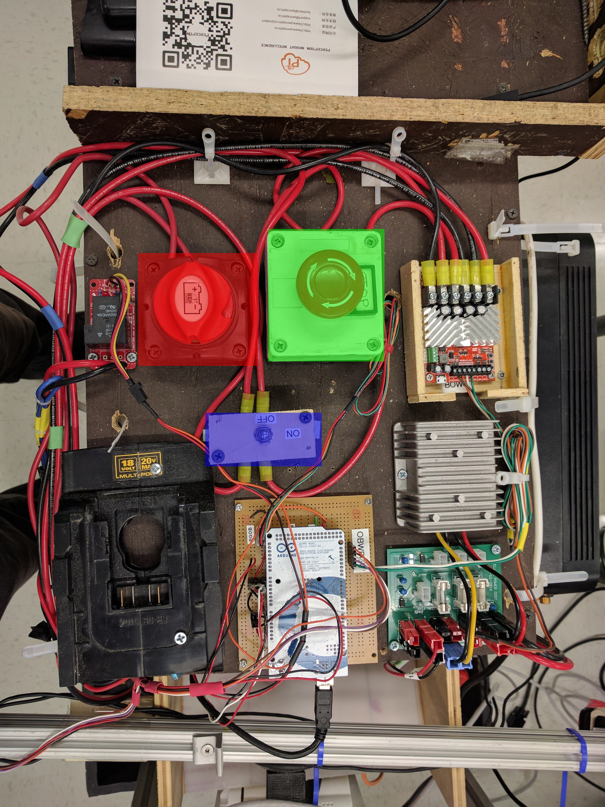

# Operation Guide

## Quick Start

To turn on the robot, there are 2 buttons/knobs to turn

1. First turn the main power knob (highlighted in red)
2. Then turn on the drive power by enabling the button (highlighted in green) by twisting this
3. Finally connecting the drive motor circuit is accomplished by flipping the switch to on (highlighted in blue). This can be done at anytime when you're absolutely certain you want the robot to move.

After this is done, the laptop system should be booted up and the USB connections should all be connected.

To start up the whole robot software stack, assuming all the installed components are there, on simply has to run the command:
`roslaunch navigation navigation.launch`

## Configurations

#### Yolo2 Package
To configure the cameras properly, we were working with a stero vision package to simply grab 2 images at once. The yolo2.launch contains the /dev/videoX mapping for the downward and forward facing cameras.

The /data folder has the cfg for the Yolo detections. One should also put the weight files here. These are not commited because these can be very large.

#### Arduino
The navigation.lauch file has an Arduino device id. This should be configured to the arduino